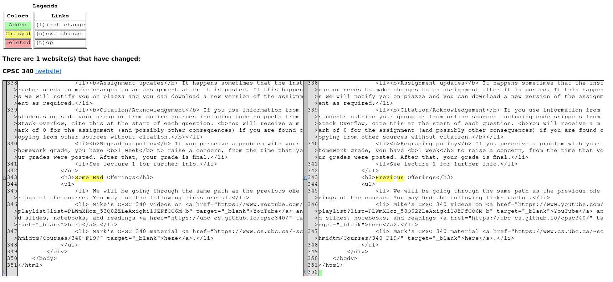

# Website Watcher

A heavily automated solution to checking certain simple academic websites
regularly.

## Requirements

- Python
- Pipenv

For your environmental variables, make sure the following are set:

- `SENDGRID_KEY`: API key you got from sendgrid
- `CACHE_DIR`: Directory (relative to this one) you want to place cached HTML
  files (that have changed) for comparing later. This directory will be changed
  as frequently as you run the program.
- `FROM_EMAIL`: Email you send from, that you have control over, of course.
- `TO_EMAIL`: Email you send the data to. You should probably have control over
  this email as well.

## Running

You are meant to place the commands to run it in a cron file and have it run
regularly. For testing purposes you can also run it manually.

```bash
pipenv run watch <CSV filename>
```

The CSV file contains entries where the first element is a unique name that
identifies that entry (must be unique) and the second element is the URL to get
the HTML from. Here is an example:

```csv
Google Canada,https://www.google.ca
Facebook,https://www.facebook.com
reddit,https://www.reddit.com
```

## Screenshots


